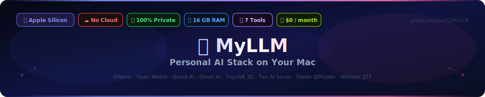
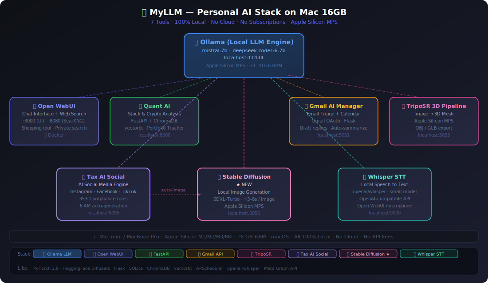

<div align="center">



</div>

# 🤖 MyLLM – Personal AI Stack on Your Mac

> Run a complete private AI ecosystem locally using **Ollama**, **Open WebUI**, and purpose-built tools for email, finance, 3D generation, image generation, speech-to-text, and social media marketing. **No cloud. No subscriptions. No data leaving your machine.**

<div align="center">



</div>

---

## 🧰 Tools in This Stack

| Tool | Purpose | Port |
|------|---------|------|
| 💬 **Open WebUI + SearXNG** | Chat UI with private web search | :3000 / :8080 |
| 📈 **Quant AI** | Stock & crypto analysis + portfolio tracker | :8000 |
| 📬 **Gmail AI Manager** | AI email triage, summarize, draft replies + Calendar | :5051 |
| 🎨 **Stable Diffusion** | Local text-to-image generation · Apple Silicon MPS | :5050 |
| 🧊 **TripoSR 3D Pipeline** | Image → 3D mesh (Apple Silicon) | :5050 |
| 🤖 **Tax AI Social** | AI social media content engine for tax/accounting firms | :5055 |
| 🎙️ **Whisper STT** | 100% local speech-to-text for Open WebUI | :9000 |

---

## 🏗️ Architecture

```
                    🦙 Ollama (localhost:11434)
                    mistral:7b · deepseek-coder:6.7b
                    Apple Silicon MPS · ~4-10GB RAM
                           │
        ┌──────────────────┼──────────────────────┐
        │                  │                      │
        ▼                  ▼                      ▼
  💬 Open WebUI      📈 Quant AI           📬 Gmail AI
  :3000              :8000                 :5051
  + SearXNG          FastAPI+ChromaDB      Gmail API
  :8080              vectorbt              Auto-triage

        │                  │
        ▼                  ▼
  🧊 TripoSR         🤖 Tax AI Social
  :5050              :5055
  Image→3D           Instagram/Facebook/TikTok
  OBJ/GLB export     Compliance + Auto-Post
```

---

## 📋 Requirements

- **macOS** (Apple Silicon M1/M2/M3/M4 recommended) or Linux
- **16 GB RAM** recommended (8GB minimum for basic use)
- **Docker Desktop** — https://www.docker.com/products/docker-desktop/
- **15+ GB free disk space** (for models + tools)
- Internet connection (for initial setup only)

---

## 🚀 Quick Start

### Step 1 — Clone the repo
```bash
git clone https://github.com/jup313/MYLLM.git
cd MYLLM
```

### Step 2 — Run setup
```bash
chmod +x setup.sh install-tools.sh
./setup.sh
```

This will:
- Install Ollama
- Download `mistral:7b` and `deepseek-coder:6.7b` models
- Start Open WebUI on http://localhost:3000
- Start SearXNG on http://localhost:8080

### Step 3 — Create your account
1. Open http://localhost:3000
2. Click **Sign Up** and create your admin account
3. The first account is automatically admin

---

## 💬 Tool 1 — Open WebUI + SearXNG

**Chat with local AI models + private web search.**

| URL | Description |
|-----|-------------|
| http://localhost:3000 | Chat interface |
| http://localhost:8080 | SearXNG search engine |

### Enable web search
1. Click the **✨ sparkle icon** in chat input
2. Toggle **Web Search** ON
3. Ask any question — AI searches privately via SearXNG

### Install Shopping Search Tool
```bash
./install-tools.sh your@email.com yourpassword
```

---

## 📈 Tool 2 — Quant AI

**AI-powered stock and crypto analysis running 100% locally.**

```bash
cd quant_api
pip install -r requirements.txt
python main.py
```

- FastAPI + ChromaDB vector database
- vectorbt for backtesting
- curl-cffi for market data
- Ask natural language questions about stocks and crypto

---

## 📬 Tool 3 — Gmail AI Manager

**Local AI that reads, summarizes, categorizes, and drafts replies to your emails.**

```bash
cd gmail-ai-manager
bash setup.sh
bash start.sh
# Open: http://localhost:5051
```

Features:
- ✅ Auto-summarize inbox (no email ever leaves your machine)
- ✅ Categorize by priority (urgent / action / info / promo)
- ✅ Draft AI replies with one click
- ✅ Unsubscribe detection
- ✅ Requires Gmail OAuth credentials (stays 100% local)

---

## 🧊 Tool 4 — TripoSR 3D Pipeline

**Generate 3D meshes from images using Apple Silicon GPU (MPS).**

```bash
cd triposr-pipeline
bash setup.sh     # First time only — installs TripoSR
bash start-ui.sh
# Open: http://localhost:5050
```

**Pipeline:**
```
Your prompt → Stable Diffusion image → TripoSR → OBJ/GLB mesh
```

- Uses Apple Silicon MPS (Metal Performance Shaders)
- Memory usage: ~6–10GB
- Output: OBJ + GLB files ready for Blender, Unity, web
- Best open-source 3D model for Mac 16GB

---

## 🤖 Tool 5 — Tax AI Social ⭐ NEW

**AI-powered social media content engine for tax preparation, tax resolution, and bookkeeping firms.**

### What it does
- Automatically generates **Instagram, Facebook, and TikTok** posts daily at 6 AM
- Uses your local Ollama LLM (`mistral:7b`) — no OpenAI API needed
- **35+ compliance rules** block misleading tax claims automatically
- Human review dashboard — Approve ✅, Edit ✏️, or Reject ❌ before posting
- Auto-posts to Facebook/Instagram via Meta Graph API on approval
- Business contact info (phone, WhatsApp, email, website) auto-appended to every post

### Setup
```bash
cd tax-ai-social
bash setup.sh
cp .env.example .env
# Edit .env — add your firm info and Meta API credentials
bash start.sh
# Open: http://localhost:5055
```

### Dashboard features
- **⚡ Generate Now** — single post or full daily batch (5 posts)
- **📋 Posts tab** — review drafts, approve, edit, or reject
- **⚙️ Business Settings tab** — update firm name, phone, email, website, WhatsApp, fax, etc. without touching files
- **6 AM auto-generation** — every morning, 5 posts ready for review
- **Compliance checker** — flags and blocks prohibited phrases before you see them

### Platforms supported
| Platform | Type | Auto-posts? |
|----------|------|-------------|
| Instagram | Image caption | ✅ (with image URL) |
| Facebook | Text post | ✅ |
| TikTok | Video script | ❌ Manual (record yourself) |

### Specialties supported
- Tax Preparation
- Tax Resolution (IRS debt, payment plans, OIC)
- Bookkeeping

---

## 🤖 AI Models

| Model | Size | Best For |
|-------|------|----------|
| `mistral:7b` | 4.4 GB | General chat, posts, email, social media |
| `deepseek-coder:6.7b` | 3.8 GB | Code generation, debugging, quant analysis |

### Pull additional models
```bash
ollama pull llama3.2        # Meta's Llama 3.2 (3B)
ollama pull phi4            # Microsoft Phi-4 (14B)
ollama pull qwen2.5-coder   # Qwen coding model
ollama list                 # See all installed models
```

---

## 🛑 Stop / Start Services

```bash
# Stop Docker services (Open WebUI + SearXNG)
docker compose down

# Start Docker services
docker compose up -d

# View logs
docker compose logs -f

# Restart a specific service
docker compose restart open-webui
```

---

## 📁 Project Structure

```
MYLLM/
├── README.md                     # This file
├── docker-compose.yml            # Open WebUI + SearXNG
├── setup.sh                      # One-command setup
├── install-tools.sh              # Install Open WebUI tools
├── shopping_search_tool.py       # Amazon/eBay search tool
├── quant_tool.py                 # Quant analysis Open WebUI tool
├── searxng/                      # SearXNG config
├── quant_api/                    # Quant AI FastAPI backend
├── gmail-ai-manager/             # Gmail AI email manager
├── triposr-pipeline/             # Image → 3D mesh pipeline
│   ├── architecture.svg          # Full stack diagram
│   └── ...
├── tax-ai-social/                # ⭐ Tax AI Social Media Engine
│   ├── app/
│   │   ├── main.py               # Flask API + routes
│   │   ├── generator.py          # Post generation engine
│   │   ├── compliance.py         # 35+ tax compliance rules
│   │   ├── poster.py             # Meta Graph API posting
│   │   ├── scheduler.py          # 6 AM daily auto-generation
│   │   └── database.py           # SQLite post tracking
│   ├── prompts/                  # 7 platform-specific prompts
│   ├── templates/index.html      # Dark-mode dashboard
│   ├── .env.example              # Config template
│   ├── requirements.txt
│   ├── setup.sh
│   └── start.sh
└── whisper-stt/                  # ⭐ Local Voice / Speech-to-Text
    ├── server.py                 # OpenAI-compatible STT API
    ├── requirements.txt
    ├── setup.sh
    ├── start.sh
    └── README.md
```

---

## 🔧 Troubleshooting

### Ollama not connecting
```bash
ollama list          # Check if running
ollama serve         # Start if not running
```

### Docker containers not starting
```bash
docker compose down
docker compose up -d
docker compose logs
```

### Tax AI Social — Ollama model not found
```bash
ollama pull mistral:7b     # Download the model
ollama serve               # Make sure Ollama is running
```

### Port conflicts
Edit `docker-compose.yml` or the relevant `.env` file to change ports.

---

## 🔒 Privacy

Everything runs **100% locally**:
- No data sent to OpenAI, Anthropic, or any cloud service
- SearXNG proxies web searches anonymously
- Gmail AI only reads emails locally via OAuth — nothing uploaded
- Tax AI Social posts never leave until you click Approve
- All AI inference runs on your Mac's Apple Silicon chip

---

## 🎙️ Tool 6 — Whisper STT ⭐ NEW

**100% local speech-to-text for Open WebUI — talk to your AI instead of typing.**

```bash
cd whisper-stt
bash start.sh
# Server starts at http://localhost:9000
```

First run downloads the Whisper `small` model (~460 MB, one time).

### Connect to Open WebUI
1. Open **http://localhost:3000**
2. Profile icon → **Settings** → **Audio**
3. Speech to Text:
   - Engine: **OpenAI API**
   - Base URL: `http://localhost:9000/v1`
   - API Key: `local`
4. Save — click the **🎤 microphone** in chat to speak!

### Model options
| Model | Size | Speed | Best For |
|-------|------|-------|----------|
| `tiny` | ~75 MB | ~0.3s | Quick testing |
| `base` | ~145 MB | ~0.5s | English-only |
| `small` | ~460 MB | ~1s | **Recommended ✅** |
| `medium` | ~1.5 GB | ~3s | Best accuracy |

```bash
WHISPER_MODEL=medium bash start.sh   # Use a larger model
```

- ✅ 100% private — audio never leaves your Mac
- ✅ Works offline after first setup
- ✅ Multi-language support (auto-detects)
- ✅ OpenAI-compatible API format

---

## 📈 Quant AI — Portfolio Tracker Dashboard

**Track your stock/crypto holdings with live prices, gain/loss, and allocation chart.**

Open: **http://localhost:8000/portfolio**

| Feature | Details |
|---------|---------|
| 📊 Positions table | Ticker, shares, avg cost, current price, gain/loss, day change |
| 🍩 Allocation donut chart | Visual portfolio breakdown (Chart.js) |
| 👁️ Watchlist | Track tickers without holding them |
| ⟳ Live prices | Auto-fetches via Yahoo Finance on page load |
| ➕ Add / remove | Simple form — no file editing needed |

```bash
cd quant_api
python main.py
# Open: http://localhost:8000/portfolio
```

---

## 📅 Gmail AI — Calendar Integration

**Detect meetings in emails and add them to Google Calendar automatically.**

Open: **http://localhost:5051** → click **📅 Calendar** in sidebar

| Feature | Details |
|---------|---------|
| 🔍 Meeting detection | Scans emails for Zoom, time mentions, meeting keywords |
| 🤖 LLM extraction | Uses Ollama to extract date/time/location from email body |
| 📅 One-click add | Click **📅 Add to Calendar** on any detected meeting email |
| ➕ Manual events | Create events directly from the dashboard |
| 📋 Upcoming view | See next 7 days of Google Calendar events |

**Requires:** Google Calendar API scope (enabled automatically when you re-connect Gmail OAuth)

> ⚠️ If you already connected Gmail, click **🔗 Re-connect Gmail** in Settings to add Calendar scope.

---

## 🎨 Tool 7 — Stable Diffusion Image Generation

**100% local text-to-image generation on your Mac. No API key. No cloud. No limits.**

```bash
cd stable-diffusion
bash setup.sh     # First time only (~2-3 min)
bash start.sh
# Open: http://localhost:5050
```

| Feature | Details |
|---------|---------|
| ⚡ SDXL-Turbo | Default model — ~3–8s per image on M1/M2/M3 |
| 🧠 6 Models | SDXL-Turbo, SD 2.1, SD 1.5, DreamShaper, OpenJourney, Realistic Vision |
| 📐 Any size | 512×512 to 1280×1280 with 1:1, 16:9, 9:16, 4:3 presets |
| 🎲 Seed control | Reproduce or vary any image |
| 🗂️ History | Browse all generated images |
| 📱 Social Post tab | Auto-generate images for Tax AI Social posts |

### Tax AI Social Integration

When Stable Diffusion is running (`:5050`), Tax AI Social will **automatically generate images** for Instagram and Facebook posts. Just start both services:

```bash
# Terminal 1
cd stable-diffusion && bash start.sh

# Terminal 2
cd tax-ai-social && bash start.sh
```

Images are auto-selected based on post content (IRS/debt → resolution style, family → family style, etc.).

### API

```bash
# Generate image
curl -X POST http://localhost:5050/api/generate \
  -H "Content-Type: application/json" \
  -d '{"prompt": "professional tax accountant, modern office, 4K", "model": "sdxl-turbo", "steps": 4}'

# Use in Python
from stable_diffusion.sd_client import generate_for_post
img_url = generate_for_post("Tax deadline April 15th", specialty="tax_preparation")
```

---

## 🗺️ Roadmap

- [x] ~~Stable Diffusion image generation~~ — ✅ Done! (`stable-diffusion/` + Tax AI Social integration)
- [ ] LinkedIn support for Tax AI Social
- [x] ~~Quant AI portfolio tracker dashboard~~ — ✅ Done! (`/portfolio`)
- [x] ~~Gmail AI calendar integration~~ — ✅ Done! (Calendar tab)
- [x] ~~Voice interface for Open WebUI~~ — ✅ Done! (Whisper STT)

---

Built with ❤️ using [Ollama](https://ollama.com) · [Open WebUI](https://github.com/open-webui/open-webui) · [SearXNG](https://github.com/searxng/searxng) · [TripoSR](https://github.com/VAST-AI-Research/TripoSR) · [Flask](https://flask.palletsprojects.com) · Apple Silicon 🍎
